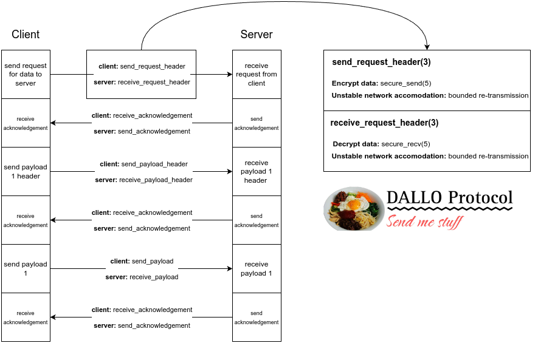

# DALLO Protocol Documentation

David Jara  
Ben Meister  
Cordus Bailey  

# What is the DALLO Protocol

The **DALLO** Protocol is an application-layer protocol using TCP for the transport layer. "DALLO Protocol" is an abbreviation of "Dave's Accelerated Lightweight Lossless Open Protocol." It was built specifically for this project, from scratch. 

# How Does it Work

The DALLO Protocol is based around synchronicity and simplicity. Likewise, each time a piece of data is sent/received, it must be  acknowledged by the recipient. This acknowledgement procedure ensures that the sender and receiver remain synchronized as it pertains to the particular item that is being sent/received. 

The DALLO Protocol was also developed with security in mind, which is why it utilizes Diffie-Hellman key exchange to encrypt and decrypt data sent between the client and server. 

As can be seen in the image above, each time a piece of data is received, the recipient sends an acknowledgement to the sender. A sender never sends more than one thing before hearing from the recipient. This keeps them on the same page about what is being sent and received. 

At the same time, the functions that are being used to send/receive the data structures used by the DALLO Protocol utilize modified versions of the `send` and `recv` functions. These functions (`secure_send` and `secure_recv`) have all the same parameters as `send` and `recv`, except for an additional one - the key the client and server share as per Diffie-Hellman key exchange. This key is used by the `secure_send` function to encrypt outbound data; it is also used by the `secure_recv` function to decrypt inbound data. If data is ever intercepted by an outside party, it will be completely illegible.

The DALLO Protocol also works well with unstable connections, using bounded re-transmission attempts to ensure data is not lost.
