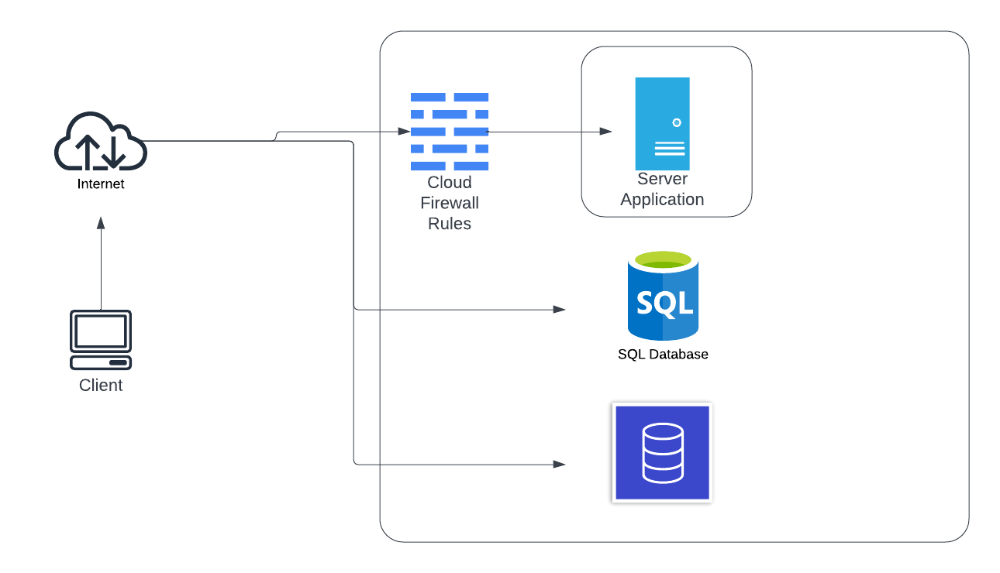
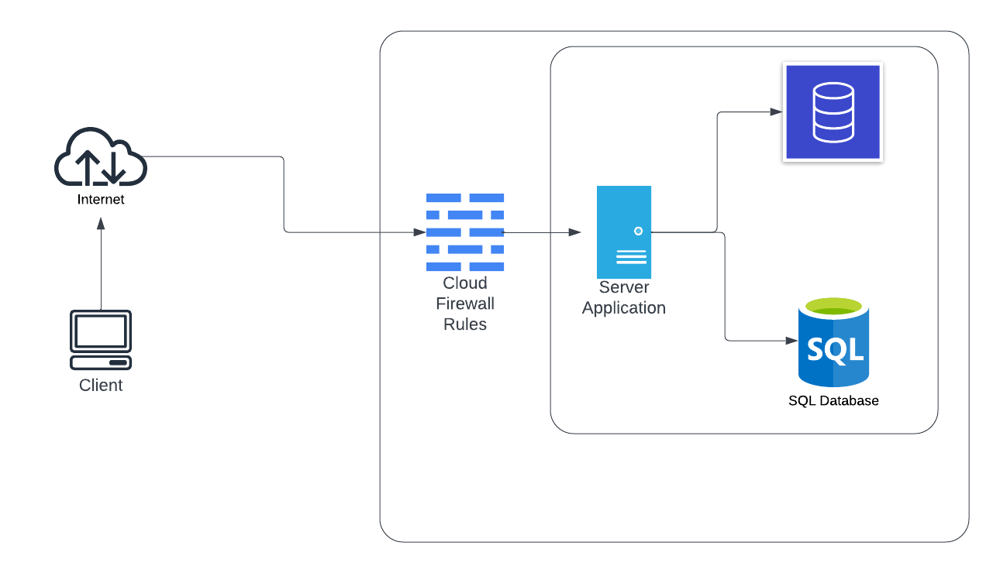

# Infrastructure Layout

## Table of Contents
1. [Overview](#overview)
2. [Development Setup](#development-setup)
3. [Deployment Setup](#deployment-setup)
4. [Firewall Configuration](#firewall-configuration)
5. [Local Usage](#local-usage)


<br>
<br>

## Overview
We decided to go with a cloud service provider to hosr our server side application and give a cloud infrastructure. We chose to go with DigitalOcean as the GitHub Student Developer Pack gives $200 in credits to use for a year. This gave us more than enough to acquire a droplet(VM) and managed databases for storage.

<br>
<br>

## Development Setup
For the development of the project, we decided to make it easier to access the databases. To help with this, we allowed the databases to be public facing to allow all outside connections. This lets us easily configure the databases and do all necessary setup easily without connecting to the server VM first.

The following diagram show the cloud environment setup for the development:


<br>
<br>

## Deployment Setup
For the deployment of the project, we move the databases into a Virual Private Cloud(VPC) to segment them from internet. This allows only the server VM to connect to the databases and not outside connections. Doing this secures the connection between the server and databases since it is over an internal network.

The following diagram show the cloud environment setup for the deployment:



<br>
<br>

## Firewall Configuration
To secure the cloud VM certain firewall rules were set. We are using the TCP protocol over port 8080 to communicate from the client to the server. To make sure only necessary connections are allowed, the following firewall rules were put in place:

Inbound:
- TCP on port 8080
- SSH on port 22

Outbound: 
- TCP on port 8080
- TCP on port 25060(MySQL)
- TCP on port 27017(MongoDB)

<br>
<br>

## Local Usage
This setup can also be deployed locally for testing or other purpose. To setup locally, you will need a local MySQL database and MongoDB database. You will also need to change the connection strings in the server.c code to make sure they connect to the local databases.

Next you can recompile the server code and run it:
```
./comp.sh
./server
```

The connection string for the client needs to be changed from the server IP used to the local IP '127.0.0.1' for local usage. THen the client can be recompiled and ran:
```
./comp.sh
./client
```