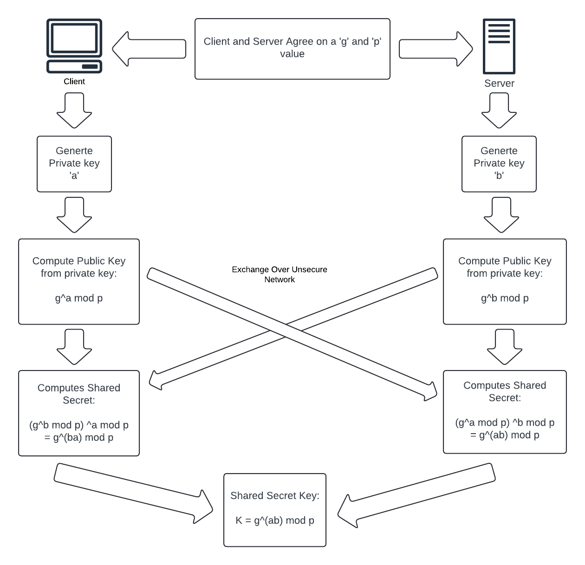
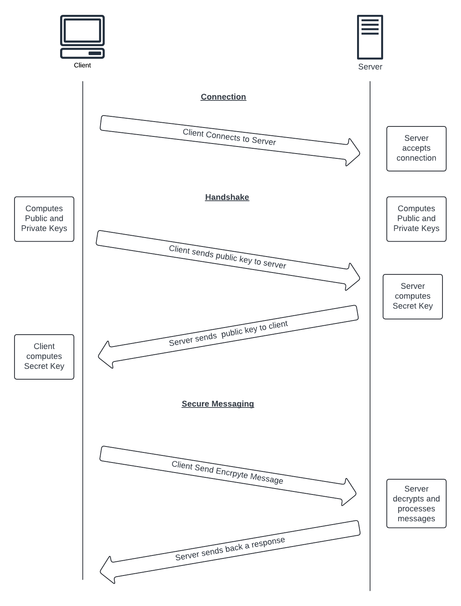

# Secure Connection Library

## Table of Contents
1. [Overview](#overview)
2. [Key Structures and Functions](#key-structures-and-functions)
3. [Usage Examples](#usage-examples)

<br>
<br>

## Overview

This library provides functions for secure communication between clients and servers using Diffie-Hellman key exchange. It includes implementations for key generation, shared secret computation, client-server handshake, and message encryption/decryption.

<br>
<br>

## Key Structures and Functions

### DHKeyPair Structure

Represents a Diffie-Hellman key pair.
```
typedef struct {
    uint32_t private_key;
    uint32_t public_key;
} DHKeyPair;
```

### Key Generation Functions

- Creates a Diffie-Hellman key pair and computes the shared secret between two parties.

- Keys are generated each time a new connection is made, following a 'Ephemeral Diffie-Hellman'.
- A random prime number gets generated for 'p'
- 'g' is agreed upon prior, in this case '2' is used
- Using these values, a private key is generated and a public key generated from the private key



<br>
<br>

### Client-Server Handshake Functions

- Handles the client-server handshake protocol, returning the computed shared secret.
- There is a function 'client_handshake' to handle the client side
- There is a function 'server_handshake' to handle the server side

- This handshake process follow the traditional Diffie-Hellman key exchange process

#### The client:
    1. Sends its created public key to the server
    2. Receives the server's public key
    3. Computes the shared key with clients private key and servers public key

#### The server:
    1. Receives the clients public key
    2. Sends the client the server's public key
    3. Computes the shared key with servers private key and clients public key

#### The process as a whole:
    1. Client intitates connection to server
    2. Client starts handshake process by sending its public key
    3. Server receives client public key
    4. Server sends its public key to client
    5. Client receives the server's public key
    6. Both client and server compute shared key

#### The following diagram shows this process:


<br>
<br>

### Sending and Receiving encrypted messages
- This library implements a secure send and recieve by encrpyting and decrypting a message using the shared key between the client and server.
- These functions simply take either the plain text and encrypt it or the encrypted text and decrypt it, while using the normal 'send' and 'recv' functions.

#### Sending:
- Sending is done by providing the socket, message, message length, flags, and the shared key
- The following function call is an example of how this is used:
```
ssize_t bytes_sent = secure_send(tcp_socket, message, strlen(message), 0, shared_secret);
```
- This call will take the plaintext and encrypt it
- It then sends the encrypted message using the 'send()' function

#### Receiving:
- Receiving is done by providing the socket, encrypted message, size of message, and shared key
- The following function calls is an exmaple of how this is used:
```
ssize_t bytes_received = secure_recv(client_socket, buffer, sizeof(buffer), 0, shared_secret);
```
- This call will use the 'recv()' function to get the data being sent
- It then takes the encrypted message and turns in into plaintext in the buffer

<br>
<br>

## Usage Examples

Server usage:
```
uint32_t shared_secret;
server_handshake(client_socket, &shared_secret);
```

Server usage with error handling:
```
uint32_t shared_secret;
if (server_handshake(client_socket, &shared_secret) < 0) {
    fprintf(stderr, "Server handshake failed.\n");
    close(client_socket);
    exit(EXIT_FAILURE);
}
```

Client usage:
```
uint32_t shared_secret;
server_handshake(tcp_socket, &shared_secret);
```

Client usage with error handling:
```
uint32_t shared_secret;
if (client_handshake(tcp_socket, &shared_secret) < 0) {
    fprintf(stderr, "Server handshake failed.\n");
    close(client_socket);
    exit(EXIT_FAILURE);
}
```

<br>
<br>

## Additional Information

For detailed implementation details and code examples, please refer to the source code files in the `src/lib/` directory, where the files are named 'secure_connection.c' and 'secure_connection.h'.
